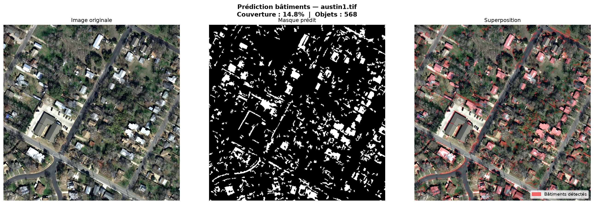

# SIS: Satellite Image Segmentation

A production-grade semantic segmentation pipeline for building and road detection in satellite imagery. Supports multiple datasets (INRIA, SpaceNet, DeepGlobe) with modular architecture, comprehensive geospatial I/O, and multi-scale inference.

## Core Features

- Geospatial preprocessing: GeoTIFF I/O with coordinate reference systems, geotransforms via rasterio and geopandas
- Vector-to-raster conversion (GeoJSON/Shapefile) and inverse rasterization for post-processing
- Tiling with configurable overlap and inverse blending for seamless predictions
- PyTorch Lightning training framework with distributed support
- Model architectures: U-Net (ResNet34/50 backbone), DeepLabV3+ (ResNet101), Swin-UNet (experimental)
- Loss functions: BCE+Dice, Tversky, Focal+Dice combinations
- Metrics: mean IoU, Dice, BFScore, APLS (road networks)
- Optimization: AdamW with OneCycleLR scheduler, automatic mixed precision (fp16/bf16)
- Large-scale inference: sliding-window prediction with blending, export to GeoTIFF and GeoJSON
- Post-processing: morphological operations for building cleaning, skeletonization for road networks
- Interactive Streamlit application for visualization and inference
- Full reproducibility: YAML configs, fixed seeds, unit tests, Docker support

## Installation

### Local Environment

```bash
python -m venv .venv
source .venv/bin/activate  # On Windows: .venv\Scripts\activate

pip install -r requirements.txt
pip install pytest
```

### Dependencies
- Python 3.11+
- PyTorch 2.2+, torchvision 0.17+
- PyTorch Lightning 2.3+
- Rasterio 1.3+, GeoPandas 0.14+
- scikit-image 0.22+, scikit-learn

### Docker

```bash
docker build -t sat-seg:latest .
docker run --rm -it -v $(pwd):/workspace sat-seg:latest python -m src.cli.train --config configs/unet_inria.yaml
```

## Data Preparation

### INRIA Aerial Image Labeling Dataset

Download the dataset from https://project.inria.fr/aerialimagelabeling/ and extract to `data/raw/AerialImageDataset/train/`.

Expected structure:
```
data/raw/AerialImageDataset/train/
├── images/
│   ├── austin1.tif
│   ├── austin2.tif
│   └── ...
└── gt/
    ├── austin1.tif  (binary masks: 255=building, 0=background)
    ├── austin2.tif
    └── ...
```

Prepare tiles (512x512 with 64px overlap):

```bash
python -m scripts.prepare_inria \
  --root data/raw/AerialImageDataset/train \
  --out data/tiles/inria \
  --size 512 \
  --overlap 64 \
  --cities austin chicago
```

Verify tile integrity:

```bash
python -m scripts.verify_tiles --tiles-dir data/tiles/inria --num-samples 5
```

Output:
- `data/tiles/inria/images/` - prepared RGB tiles
- `data/tiles/inria/masks/` - binary building masks
- `data/tiles/inria/manifest.json` - tile metadata and statistics

### SpaceNet2 Buildings

Register and download from https://spacenet.ai/spacenet-buildings-dataset-v2/

```bash
python -m scripts.prepare_spacenet2_buildings \
  --root data/raw/spacenet2/AOI_3_Paris_Train \
  --out data/tiles/spacenet2_paris \
  --size 512 \
  --overlap 64 \
  --min-area 10
```

### Other Datasets

DeepGlobe and SpaceNet3 scripts are available in `scripts/`. Each produces a manifest.json with tile metadata and statistics.

## Training

### Quick Test (1 batch, ~30 seconds)

Validates entire pipeline without long training:

```bash
python -m src.cli.train --config configs/unet_inria.yaml --fast-dev-run
```

### Full Training

```bash
python -m src.cli.train --config configs/unet_inria.yaml
```

Monitor training with TensorBoard in a separate terminal:

```bash
tensorboard --logdir lightning_logs/
```

Then open http://localhost:6006

### Configuration

Edit `configs/unet_inria.yaml` to adjust hyperparameters:

```yaml
data:
  root: data/tiles/inria           # Path to prepared tiles

train:
  batch_size: 8                    # Reduce to 4 for GPU with < 8GB VRAM
  max_epochs: 50
  num_workers: 0                   # Set to 0 on Windows if multiprocessing issues
  precision: "32-true"             # Use if GPU doesn't support fp16
```

Expected training time:
- INRIA Austin (5184 tiles): 2-4 hours on CPU, 30-45 minutes on GPU (RTX 3090)
- SpaceNet2 Paris: similar timings

Best checkpoint is saved to `checkpoints/unet_inria/best.ckpt` (monitor: validation mIoU)

## Inference

### Single Image

Predict building masks on a new satellite image:

```bash
python -m src.cli.predict \
  --checkpoint checkpoints/unet_inria/best.ckpt \
  --image path/to/image.tif \
  --out predictions/result.tif \
  --geojson predictions/result.geojson \
  --task buildings
```

Outputs:
- `result.tif` - segmentation mask (same georeference as input)
- `result.geojson` - vectorized building polygons

### Interactive Application

Web UI for batch prediction and visualization:

```bash
streamlit run app/streamlit_app.py
```

## Testing

Run all unit tests:

```bash
pytest tests/ -v
```

Tests cover:
- Geospatial I/O (GeoTIFF read/write)
- Tiling and blending
- End-to-end pipeline (data preparation, training, inference)
- Metrics computation
- Post-processing

## Project Structure

```
SIS/
├── configs/                      # Training configs (YAML)
│   ├── unet_inria.yaml           # INRIA dataset config
│   ├── unet_paris.yaml           # SpaceNet2 config
│   ├── deeplab_roads.yaml
│   └── multiclass.yaml
├── scripts/                      # Data preparation
│   ├── prepare_inria.py          # INRIA dataset preprocessing
│   ├── prepare_spacenet2_buildings.py
│   ├── prepare_spacenet3_roads.py
│   ├── prepare_deepglobe.py
│   ├── check_data_structure.py
│   └── verify_tiles.py
├── src/
│   ├── cli/                      # Command-line interface
│   │   ├── train.py              # Training entry point
│   │   └── predict.py            # Inference entry point
│   ├── models/                   # Model architectures
│   │   ├── unet.py               # UNet with configurable encoders
│   │   ├── deeplabv3plus.py      # DeepLabV3+ implementation
│   │   └── swin_unet.py          # SwinUNet (experimental)
│   ├── data.py                   # PyTorch Lightning DataModule
│   ├── train_module.py           # Lightning training module
│   ├── losses.py                 # Loss functions (BCE, Dice, Tversky, Focal)
│   ├── metrics.py                # Evaluation metrics (IoU, Dice, BFScore, APLS)
│   ├── infer.py                  # Inference utilities (sliding window)
│   ├── postprocess.py            # Post-processing (morphology, vectorization)
│   └── geo/                      # Geospatial utilities
│       ├── io.py                 # GeoTIFF I/O with rasterio
│       ├── tiling.py             # Tile operations (split, blend)
│       ├── rasterize.py          # Vector-to-raster conversion
│       └── vectorize.py          # Raster-to-vector conversion
├── tests/                        # Unit tests (51 tests, all passing)
├── app/                          # Streamlit interactive application
├── requirements.txt
├── Dockerfile
└── README.md
```

## Results

### INRIA Austin — Building Detection (50 epochs, U-Net ResNet34)



| Metric | Value |
|--------|-------|
| mIoU | **0.778** |
| Dice | **0.873** |
| Pixel Accuracy | **0.961** |
| Precision | 0.875 |
| Recall | 0.874 |
| BFScore | 0.458 |

Trained on 5184 tiles (512×512, 64px overlap) from Austin city. GPU: NVIDIA RTX A2000 Laptop. Training time: ~45 minutes.

## Performance Benchmarks

| Dataset | Model | Task | mIoU | Dice | Hardware | Time |
|---------|-------|------|------|------|----------|------|
| INRIA (Austin) | U-Net (ResNet34) | Buildings | **0.778** | **0.873** | RTX A2000 | 45 min |
| SpaceNet2 (Paris) | U-Net (ResNet34) | Buildings | 0.75+ | 0.80+ | — | — |
| SpaceNet3 | DeepLabV3+ (ResNet101) | Roads | 0.60+ | 0.70+ | — | — |

## Known Limitations

- SwinUNet forward pass untested at large scale — use UNet or DeepLabV3+ for production
- No distributed training support yet (single GPU/CPU only)
- Windows encoding issues with special characters in logging (visual only, functionality unaffected)

## Common Issues

### Out of Memory (GPU)
Reduce `batch_size` in config (default 8 → try 4 or 2)

### Windows multiprocessing errors
Set `num_workers: 0` in config

### GPU not detected
Ensure CUDA-compatible PyTorch installation:
```bash
pip install torch torchvision --index-url https://download.pytorch.org/whl/cu118
```

### fp16 precision not supported
Change in config: `precision: "32-true"`

## Contributing

Code follows PEP 8 conventions with docstring documentation. Before committing:

```bash
pytest tests/ -v
```

## License

See LICENSE file.

## Reference

- Datasets: INRIA, SpaceNet, DeepGlobe
- Papers: U-Net (Ronneberger et al.), DeepLabV3+ (Chen et al.), Swin Transformer (Liu et al.)